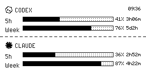

# Quote AI Usage

Quote AI Usage is a 296x152 black-and-white e-ink dashboard for MindReset Quote/0 devices. It shows OpenAI Codex and Claude subscription usage in matching panels, with remaining quota bars and reset countdowns.

Quote AI Usage 是一个用于 MindReset Quote/0 设备的 296x152 黑白墨水屏仪表盘。它以统一版式展示 OpenAI Codex 和 Claude 订阅用量，包括剩余额度条和重置倒计时。



## Features / 功能

- Codex and Claude panels share the same header height, row height, bar height, and right-side alignment.
- Usage bars show remaining quota, while the raw API values are tracked as percent used.
- Claude usage supports the Claude Code OAuth usage API and falls back to `claude /usage` when local OAuth credentials are unavailable.
- Codex usage reads the OpenAI/Codex OAuth token from `~/.codex/auth.json` by default.
- Includes a 16x16 monochrome Claude symbol and Codex icon for e-ink rendering.
- Supports local preview, direct Quote/0 image push, text fallback, self-checks, and macOS launchd scheduling.

- Codex 和 Claude 两个板块使用一致的标题高度、行高、进度条高度和右侧对齐。
- 进度条显示剩余额度；底层 API 数据按已用百分比处理。
- Claude 用量支持 Claude Code OAuth usage API；本机没有 OAuth credentials 时会 fallback 到 `claude /usage`。
- Codex 默认从 `~/.codex/auth.json` 读取 OpenAI/Codex OAuth token。
- 内置 16x16 单色 Claude symbol 和 Codex 图标，适配墨水屏显示。
- 支持本地预览、直接推送 Quote/0 图片、自检、Text API fallback 和 macOS launchd 定时任务。

## Layout / 版式

```text
                        09:36
◆ CODEX
5h   [remaining bar]  41%  3h06m
Week [remaining bar]  76%  5d2h
------------------------------------------------
◆ CLAUDE
5h   [remaining bar]  36%  2h52m
Week [remaining bar]  87%  4h22m
```

Both services use the same geometry:

- `5h`: short usage window
- `Week`: long usage window
- right-side percent: remaining quota
- right-side time: reset countdown

两个服务使用同一套几何尺寸：

- `5h`：短周期用量窗口
- `Week`：长周期用量窗口
- 右侧百分比：剩余额度
- 右侧时间：重置倒计时

## Requirements / 依赖

- Python 3.11+
- Pillow and Requests from `requirements.txt`
- A logged-in `codex` CLI session, or `CODEX_ACCESS_TOKEN`
- A logged-in `claude` CLI session, or `CLAUDE_ACCESS_TOKEN`
- Quote/0 API key and device ID

## Install / 安装

```bash
pip install -r requirements.txt
cp config.example.env .env
```

Edit `.env`:

```bash
export QUOTE0_API_KEY="dot_app_..."
export QUOTE0_DEVICE_ID="..."
export QUOTE0_REFRESH_NOW="true"
```

Optional overrides:

```bash
export CODEX_ACCESS_TOKEN=""
export CODEX_ACCOUNT_ID=""
export CLAUDE_ACCESS_TOKEN=""
```

配置 `.env`：

```bash
export QUOTE0_API_KEY="dot_app_..."
export QUOTE0_DEVICE_ID="..."
export QUOTE0_REFRESH_NOW="true"
```

可选覆盖项：

```bash
export CODEX_ACCESS_TOKEN=""
export CODEX_ACCOUNT_ID=""
export CLAUDE_ACCESS_TOKEN=""
```

## Usage / 使用

```bash
# Local preview only / 只生成本地预览
source .env && python display.py --preview

# Push image to Quote/0 / 推送图片到 Quote/0
source .env && python display.py

# Self-check credentials, APIs, renderer, and device endpoint / 自检
source .env && python display.py --check

# Inspect normalized data / 查看标准化后的用量数据
source .env && python display.py --debug-json
```

The preview image is written to `/tmp/quote0_burnout_preview.png` by default. Override it with:

默认预览图路径是 `/tmp/quote0_burnout_preview.png`，可以通过环境变量覆盖：

```bash
export QUOTE0_PREVIEW_PATH="/tmp/quote-ai-usage.png"
```

## Scheduling / 定时任务

A launchd example is included for macOS:

项目包含 macOS launchd 示例：

```bash
mkdir -p "$HOME/Library/Application Support/quote-ai-usage"
rsync -a --delete --exclude ".git" ./ "$HOME/Library/Application Support/quote-ai-usage/"

cp scripts/com.createpjf.quote-ai-usage.plist.example ~/Library/LaunchAgents/com.createpjf.quote-ai-usage.plist
plutil -lint ~/Library/LaunchAgents/com.createpjf.quote-ai-usage.plist
launchctl bootstrap "gui/$(id -u)" ~/Library/LaunchAgents/com.createpjf.quote-ai-usage.plist
launchctl kickstart -k "gui/$(id -u)/com.createpjf.quote-ai-usage"
```

Edit the plist paths before loading it. The sample schedule runs every 5 minutes. On macOS, avoid running the scheduled script directly from `~/Documents`, `~/Desktop`, or `~/Downloads`; launchd may be blocked by privacy permissions.

加载前请先修改 plist 里的本地路径。示例配置每 5 分钟运行一次。macOS 上建议不要直接从 `~/Documents`、`~/Desktop` 或 `~/Downloads` 运行定时脚本；launchd 可能会被隐私权限拦截。

## Development / 开发

```bash
python3 -m unittest tests/test_claude_usage.py
python3 -m py_compile display.py render.py
node --check widget/quote0-widget.js
source .env && python3 display.py --check
```

Key files:

- `display.py`: fetch usage, normalize snapshot, push to Quote/0
- `render.py`: render 296x152 1-bit PNG
- `assets/logos/`: 16x16 monochrome service icons
- `docs/example.png`: example dashboard screenshot
- `widget/quote0-widget.js`: JSBox widget companion
- `skill/`: implementation notes and e-ink design reference

## License / 开源协议

MIT License. See [LICENSE](LICENSE).
